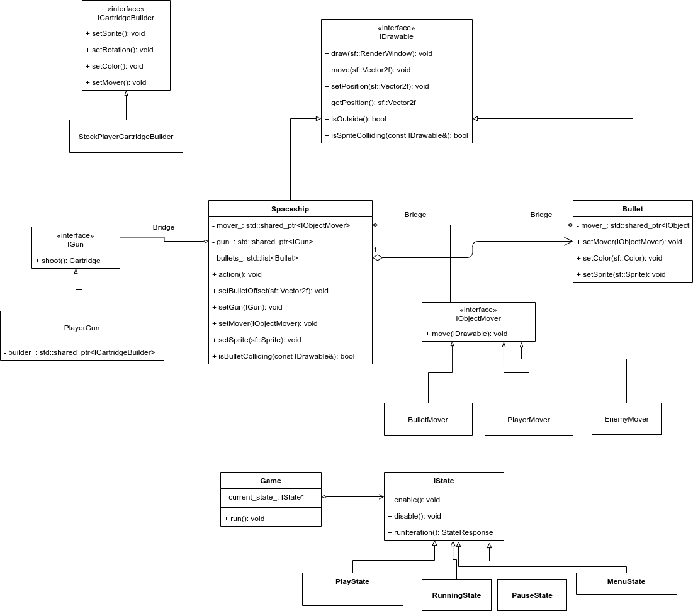

# История разработки

### 6.04.2020 

На данный момент реализованы перемещение корабля игрока (_WASD_), стрельба (_Пробел_), 
эффект полёта с помощью двигающегося фона. Написаны Unit-тесты для класса IDrawable.
Unit-тесты лежат в папке _tests_.  

##### Подробнее об архитектуре:

Главный скрипт игры содержится в классе _Game_. Созданные абстрактные классы

- _IDrawable_ — для объектов, которые можно отобразить на экране. В игре это _Spaceship_ (корабли)
и _Bullet_ (пули, ракеты и т. д.). Каждый экземпляр имеет свой алгоритм движения и создания выстрелов
 (_IObjectMover_ и _IGun_ (только у кораблей)). Так как планируется реализовать выстрелы очередью, создан класс
 _Cartridge_ (по факту, это _std::vector<Bullet\>_). 
- _IGun_ — интерфейс для реализации стрельбы, по сути, паттерн _"строитель"_  для пуль
- _IObjectMover_ — интерфейс для реализации передвижения объекта
- _ICartridgeBuilder_ — интерфейс строителя очереди пуль

##### Что планируется:

В дальнейшем будут добавлены противники и взаимодействие с ними, графический
интерфейс, подсчёт очков.

### 3.05.2020 

Создан графический интерфейс на основе библиотеки TGUI. Добавлены вражеские корабли, 
которые можно уничтожать. Если столкнуться со врагом, то вы проиграете. Для поиска коллизий
использованы идеи компоновщика. Для алгоритма движения врагов использован паттерн мост. 

##### Что планируется
Реализация стрельбы противника, подсчёт очков.

